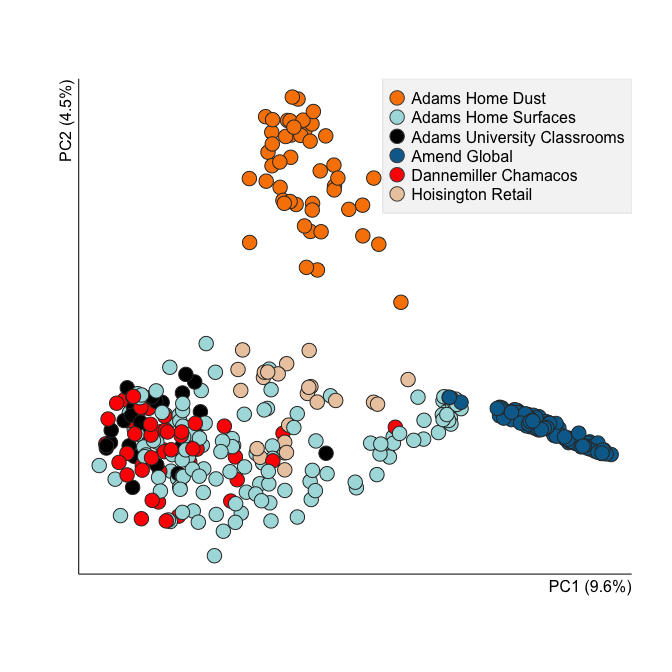
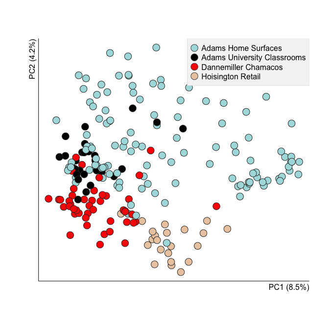

# BEMA supplemental fungal figures

Make figures for brief fungal analysis. The goal is to show that the study bias, combined with too few studies makes combined analysis goofy. 


```r
library(wesanderson)
library(scales)
```


```r
# setwd('~/Dropbox/BEMA/bacteriaHTS/closed_ref_pickedOTUs/R/fungalSupp')
pcAll <- read.delim('binary_sorensen_dice_pc.txt', head=TRUE, row.names=1)
pcNoAA <- read.delim('binary_sorensen_dice_pcNoAmend.txt', head=TRUE, row.names=1)
map <- read.delim('map.txt', head=TRUE, row.names=1)[-1, ]
```


```r
head(map)  # Description
```

```
##               BarcodeSequence   LinkerPrimerSequence   Geolocation
## Adamsresdust1      ACGAGTGCGT CTTGGTCATTTAGAGGAAGTAA Albany_CA_USA
## Adamsresdust2      ACGCTCGACA CTTGGTCATTTAGAGGAAGTAA Albany_CA_USA
## Adamsresdust3      AGACGCACTC CTTGGTCATTTAGAGGAAGTAA Albany_CA_USA
## Adamsresdust4      AGCACTGTAG CTTGGTCATTTAGAGGAAGTAA Albany_CA_USA
## Adamsresdust5      ATCAGACACG CTTGGTCATTTAGAGGAAGTAA Albany_CA_USA
## Adamsresdust6      ATATCGCGAG CTTGGTCATTTAGAGGAAGTAA Albany_CA_USA
##               Building_Type Building_Type2 Room_Function
## Adamsresdust1   apt_bulding    apt_bulding       kitchen
## Adamsresdust2   apt_bulding    apt_bulding   living_room
## Adamsresdust3   apt_bulding    apt_bulding      bathroom
## Adamsresdust4   apt_bulding    apt_bulding       bedroom
## Adamsresdust5   apt_bulding    apt_bulding       balcony
## Adamsresdust6   apt_bulding    apt_bulding       kitchen
##               Sequencing_Technology Target_Region Primer_name
## Adamsresdust1   454_GS_FLX_Titanium          ITS1  ITS1F_ITS2
## Adamsresdust2   454_GS_FLX_Titanium          ITS1  ITS1F_ITS2
## Adamsresdust3   454_GS_FLX_Titanium          ITS1  ITS1F_ITS2
## Adamsresdust4   454_GS_FLX_Titanium          ITS1  ITS1F_ITS2
## Adamsresdust5   454_GS_FLX_Titanium          ITS1  ITS1F_ITS2
## Adamsresdust6   454_GS_FLX_Titanium          ITS1  ITS1F_ITS2
##               Sampling_Method Matrix Specific_Matrix    Extraction_method
## Adamsresdust1    settle_plate    air             air chloroform_powersoil
## Adamsresdust2    settle_plate    air             air chloroform_powersoil
## Adamsresdust3    settle_plate    air             air chloroform_powersoil
## Adamsresdust4    settle_plate    air             air chloroform_powersoil
## Adamsresdust5    settle_plate    air             air chloroform_powersoil
## Adamsresdust6    settle_plate    air             air chloroform_powersoil
##                  Description
## Adamsresdust1 Adams_res_dust
## Adamsresdust2 Adams_res_dust
## Adamsresdust3 Adams_res_dust
## Adamsresdust4 Adams_res_dust
## Adamsresdust5 Adams_res_dust
## Adamsresdust6 Adams_res_dust
```

```r
map$Description <- factor(map$Description)
table(map$Description)
```

```
## 
##       Adams_res_dust   Adams_res_surfaces Adams_univ_classroom 
##                   94                  160                   28 
##         Amend_global        Dann_Chamacos    Hoisington_retail 
##                  118                   46                   23
```


```r
cols <- c(wes.palette(5, 'Darjeeling2')[-3], wes.palette(5, 'Darjeeling')[c(1,4)])
cols <- cols[c(6,3,4,2,5,1)]
map$col <- ''

for(i in 1:nlevels(map$Description)) {
  these <- which(map$Description == levels(map$Description)[i])
  map$col[these] <- cols[i]
  }
```


```r
perExplAll <- pcAll['% variation explained', ]
perExplNoAA <- pcNoAA['% variation explained', ]
perExplAll[c(1,2)]; perExplNoAA[c(1,2)]
```

```
##                          X1    X2
## % variation explained 9.626 4.508
```

```
##                          X1    X2
## % variation explained 8.466 4.182
```

```r
sum(perExplAll)
```

```
## [1]100
```

```r
dim(pcAll)
```

```
## [1] 375 373
```

```r
pcAll <- pcAll[-c(nrow(pcAll), nrow(pcAll)-1), c(1,2)]
pcNoAA <- pcNoAA[-c(nrow(pcNoAA), nrow(pcNoAA)-1), c(1,2)]
```


```r
all(row.names(pcAll) %in% row.names(map))
```

```
## [1] TRUE
```

```r
all(row.names(pcNoAA) %in% row.names(map))
```

```
## [1] TRUE
```


```r
mapAll <- map[row.names(pcAll), ]
mapNoAA <- map[row.names(pcNoAA), ]
```


```r
leg <- data.frame(levs = levels(mapAll$Description), cols=cols)

leg$legend <- 'Adams Home Dust'
leg$legend[leg$levs == 'Adams_res_surfaces'] <- 'Adams Home Surfaces'
leg$legend[leg$levs == 'Adams_univ_classroom'] <- 'Adams University Classrooms'
leg$legend[leg$levs == 'Amend_global'] <- 'Amend Global'
leg$legend[leg$levs == 'Dann_Chamacos'] <- 'Dannemiller Chamacos'
leg$legend[leg$levs == 'Hoisington_retail'] <- 'Hoisington Retail'


legNoAA <- leg[-c(1, 4), ]
ch <- function(x) {as.character(x)}
```


```r
#pdf('pcAllFungal.pdf', useDingbats=FALSE)
plot(pcAll, pch=21, col='gray20', bg=alpha(mapAll$col, alpha=1), cex=2, 
     bty='l', ann=FALSE, xaxt='n', yaxt='n')
legend('topright', legend=leg$legend, 
       pch=21, pt.bg=ch(leg$cols), col='gray30', pt.cex=2, cex=1, 
       bg='gray96', box.col='gray90')
mtext('PC1 (9.6%)', side=1, adj=1, line=.1)
mtext('PC2 (4.5%)', side=2, adj=1, line=.2)
```

 

```r
#dev.off()
```


```r
#pdf('pcNoAAFungal.pdf', useDingbats=FALSE)
plot(pcNoAA, pch=21, col='gray20', bg=alpha(mapNoAA$col, alpha=1), cex=2, 
     bty='l', ann=FALSE, xaxt='n', yaxt='n')
legend('topright', legend=legNoAA$legend, 
       pch=21, pt.bg=ch(legNoAA$cols), col='gray30', pt.cex=2, cex=1, 
       bg='gray96', box.col='gray90')
mtext('PC1 (8.5%)', side=1, adj=1, line=.1)
mtext('PC2 (4.2%)', side=2, adj=1, line=.2)
```

 

```r
#dev.off()
```


